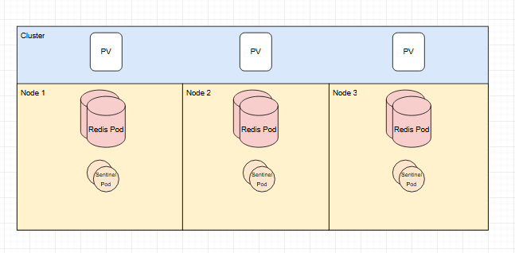
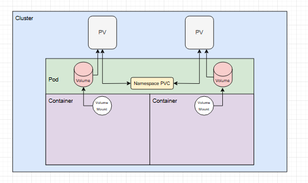

# AI-Stock-Prediction

- [Backend](#backend)
- [Frontend](#frontend)
- [Monitoring](#monitoring)
- [Kubernetes](#kubernetes)


## Backend

Hello, this project was created to practice my programming skills and further explore the architecture involved with developing a full stack application.
To get started, we can start by taking a look into the backend of this application which was developed using a combination of Python and Flask to make a awesome asynchronous API.
This backend utilizes a combination of MongoDB and Redis for persisting data in which the sklearn Linear Regression model can use of learning.

Essential when a user submits a POST request to `/api/result/` with the stock symbol they are quering about, the program will start by first fetching this stocks data from MongoDB.
If the data was recently queried, this function will first check Redis for the dataframe to increase response times, but if the dataframe is not in redis, it will pull this data from MongoDB using the stock symbol as
it's collection name.
```python 
async def fetch_data_from_mongodb(stock_symbol):
    try:
        cached_data = await redis.get(stock_symbol)
        if cached_data:
            df = pickle.loads(zlib.decompress(cached_data))
            return df
        else:
            collection = mongo_db[stock_symbol]
            cursor = collection.find()
            df = pd.DataFrame(list(cursor))
            if not df.empty:
                compressed_df = zlib.compress(pickle.dumps(df))
                await redis.setex(stock_symbol, 60, compressed_df)
            else:
                print("No data found")
            return df
    except Exception as e:
        print(e)
```

After getting the data frame for the stock's symbol, the program will then begin processesing this data by splitting it into training and testing data. The split for these data types is 80% Testing & 20% Training.
```python
split_index = int(0.8 * len(stock_data))
    split_date = stock_data.iloc[split_index]['Date']

    train_data = stock_data[stock_data['Date'] < split_date]
    test_data = stock_data[stock_data['Date'] >= split_date]

    features_train = train_data[['Open', 'High', 'Low']]
    target_train = train_data['Close']
    features_test = test_data[['Open', 'High', 'Low']]
    target_test = test_data['Close']
```

The last stop for this AI generated data predictions is to actual create and train the model. This has been made simple using the sklearn Linear Regression algorithm
```python
model = LinearRegression()
    model.fit(features_train, target_train)
    predictions = model.predict(features_test)
    mse = mean_absolute_error(target_test, predictions)
```

There are two important calculations made from the model, `predictions` & `mse`. The predictions is the calculations of the stocks data points that was trained using the previous data. MSE stands for
Mean Squared Error, in short calculate the average error produced by this algorthims calculations. This is important in determining the algorithms accuracy as a high MSE, would result in an inaccurately
produced prediction.

## Frontend

This frontend description will focus mainly on the different ways in which the Typescript React application interacts with the Async API. For starters, the application begins by making a query to the API's
`/api/stocks/all` endpoint, which returns a list of each of the available stocks to predict. 
```typescript
const apiHost = process.env.FLASK_BACKEND_URL || 'http://localhost:5000';
  useEffect(() => {
    axios.get(`${apiHost}/api/stocks/all`)
      .then((response) => {
        setStockNamesList(response.data);
        setFilteredNames(response.data.slice(0, 4)); 
      })
      .catch((error) => {
        setErrorMessage('Failed to load stock names. Please try again.');
      });
  }, []);
```

After retrieving this data, the application will then fulfill the input form to provide a user with unique suggestions for stock selections as they type.
```typescript
useEffect(() => {
    if (searchTerm) {
      const filteredData = stockNamesList.filter(item =>
        item.toLowerCase().includes(searchTerm.toLowerCase())
      );
      setFilteredNames(filteredData.slice(0, 4));
    }
  }, [searchTerm, stockNamesList]);
```

Upon submission of a valid stock symbol, the frontend applicaiton will then send a POST request with the selected symbol's name to the `/api/result` endpoint to process this data.
As a response to this POST request, the frontend will recieve a json payload with the dataframes information to display.

## Monitoring
There has been actions taken throughout this application to help with basic web application monitoring. In order to achieve this, I utilized the open source Prometheus package. This monitoring
library as it allows users to develop custom metrics such as Counters, Gauges, Histograms, and Summaries. I was able to utilize these metric types in the API to track the following metrics.
```python
registry = CollectorRegistry()
request_counter = Counter('http_requests_total', 'Total number of HTTP requests', ['method', 'endpoint'], registry=registry)
error_counter = Counter('http_errors_total', 'Total number of HTTP errors', ['method', 'endpoint'], registry=registry)
latency_histogram = Histogram('http_request_latency_seconds', 'Histogram of HTTP request latency', ['method', 'endpoint'], registry=registry)
```

I was able to utilize these different metrics to count the number of requests, errors, and latency times for requests. Prometheus is unique in the aspect in which it will post these metrics to an http endpoint which
can later be scraped to visualize. These metrics are posted to the `/api/metrics` as seen below:
```python
@app.route('/api/metrics', methods=['GET'])
async def metrics():
    return generate_latest(registry), 200, {'Content-Type': 'text/plain; version=0.0.4; charset=utf-8'}
```

Prometheus has an interesting way of gathering the data that is posted to your endpoint. Within the Prometheus application, you can add various configuration files that will scrape this data.
```yaml
global:
  scrape_interval: 15s

scrape_configs:
  - job_name: 'flask-app'
    metrics_path: '/api/metrics'
    static_configs:
      - targets: ['<IP>:<PORT>']

```

Prometheus will then scrape this data and store it in a time series database which can be queried and viewed using either Prometheus' UI or other tools like Grafana.

## Kubernetes

Each part of this application are built into docker images and deployed into Kubernetes to help with scalability and redundancy. There are multiple components involved that help to make this work.
The fronend and backend of this application are deployed as `Loadbalancers` in order to help this application scale.

Some of the other components that are deployed with this applicaiton are `Grafana`, `Redis`, and `Prometheus`. Grafana has been deployed in the Kube space to allow for better visualization of the monitoring of this application.
The Redis cluster has been deployed using Kubernetes so that I can take advantage of the Bitnami Redis helm chart. This helm chart makes it easy for us to scale our redis instances and to have communication.

#### Cluster Level



#### Pod Level

